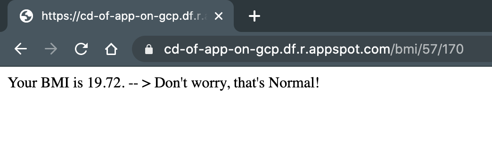

# Continuous Delivery of Flask App on Google Cloud Platform
This repo hosts a simple **Flask application** that is deployed on *Google Cloud Platform* with continuous delivery via *Google Cloud Build*. After making changes in the app and pushing it to GitHub, Cloud Build will be triggered, and the app will be checked and deployed automatically. 

The app has a few routes, one of which is BMI. It lets you specify your weight (in kg) and height (in cm) and returns your Body Mass Index (BMI).

You can check the app [here](https://cd-of-app-on-gcp.df.r.appspot.com/). 

### Check your BMI 

To check what's your BMI and its status (underweight, normal, overweight, obese) type : 

```
...com/bmi/your_weight_in_kg/your_height_in_cm
```




#### Resources 

Noah Gift's tutorials: 

[Setup Continuous Delivery on GCP Platform with Google App Engine and Cloud Build](https://www.youtube.com/watch?v=_TfWdOvQXwU&feature=youtu.be)

[Cloud Foundations](https://paiml.com/docs/home/books/cloud-computing-for-data/chapter02-cloud-foundations/)